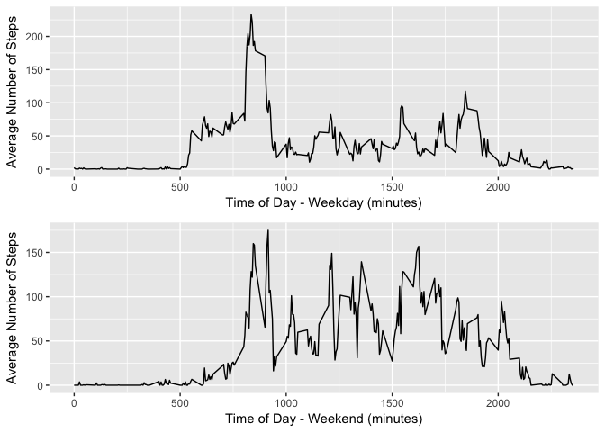

# Reproducible Research: Peer Assessment 1

## Author
Elliot Francis  
Created : 2017-4-7  
Created For : Coursera Data Science Track - Reproduceable Research Week 2 Project  

## Supporting Libraries

This analysis makes use of the ggplot2 and dplry libraries for plotting and grouping.

```r
library(ggplot2)
library(dplyr)
library(grid)
library(gridExtra)
```
## Loading and preprocessing the data

The data is pulled from the source data file. The data is then cleaned (NA cases removed) and grouped by day and day period.


```r
sourceData <- read.csv("./activity.csv")
sourceDataCleaned <- sourceData[complete.cases(sourceData),]
dayGrouped <- group_by(sourceDataCleaned, date)
periodGrouped <- group_by(sourceDataCleaned, interval)
```
## Histogram of the total number of steps taken each day

```r
dayTotalSteps <- aggregate( steps ~ date, dayGrouped, sum )
totalStepsPlot <- ggplot(dayTotalSteps, aes(dayTotalSteps$steps)) 
totalStepsPlot + geom_histogram(bins=length(unique(dayGrouped$date))) + xlab("Number of Steps") + ylab("Frequency")
```

<!-- -->

## Mean and Median number of steps taken each day

```r
mean(sourceDataCleaned$steps, na.rm = TRUE)
```

```
## [1] 37.3826
```

```r
median(sourceDataCleaned$steps, na.rm = TRUE)
```

```
## [1] 0
```


## What is the average daily activity pattern?

```r
periodAverageTotalSteps <- aggregate( steps ~ interval, periodGrouped, mean )
totalStepsPlot <- ggplot(periodAverageTotalSteps, aes(interval, steps)) 
totalStepsPlot + geom_line(stat = "identity") + xlab("Time of Day (minutes)") + ylab("Average Number of Steps")
```

<!-- -->


## Imputing missing values

The source data is now imputed by inserting the period average into NA values.


```r
## Get indexs of NA values
naIndexes <- which(is.na(sourceData$steps), arr.ind = TRUE)
## Copy Source Data to Imputed Data Object
imputedSource <- sourceData
## Copy Period Average Data into NA fields based on NA value interval
imputedSource[naIndexes, "steps"] <- periodAverageTotalSteps[periodAverageTotalSteps$interval == imputedSource[naIndexes, "interval"], "steps"]
```

## Histogram of the total number of steps taken each day 
### (Using Imputed Data)

```r
## Group Imputed Data
imputedDayGrouped <- group_by(imputedSource, date)
## Aggregate Total Steps
imputedDayTotalSteps <- aggregate( steps ~ date, imputedDayGrouped, sum )
## Plot Results
totalStepsPlot <- ggplot(imputedDayTotalSteps, aes(imputedDayTotalSteps$steps)) 
totalStepsPlot + geom_histogram(bins=length(unique(imputedDayGrouped$date))) + xlab("Number of Steps (Imputed)") + ylab("Frequency")
```

<!-- -->

## Mean and Median number of steps taken each day 
### (Using Imputed Data)

```r
mean(imputedSource$steps, na.rm = TRUE)
```

```
## [1] 37.3826
```

```r
median(imputedSource$steps, na.rm = TRUE)
```

```
## [1] 0
```

## Are there differences in activity patterns between weekdays and weekends?
### (Using Imputed Data)
Now we generate the graphs for identifing step pattern differences in the weekdays and weekends.

```r
## Load Imputed Source
weekdayJoined <- imputedSource
## Join Weekday
weekdayJoined$weekday <- weekdays(as.Date(weekdayJoined$date))
## Weekday/Weekend Mapping Function
isWeekday <- function (weekday) {
  if(weekday == "Saturday") { return("Weekend") }
  if(weekday == "Sunday") { return("Weekend") }
  return("Weekday")
}
## Map Weekdays
weekdayJoined$weekday <- sapply(weekdays(as.Date(weekdayJoined$date)), isWeekday)
## Group Data
weekdayGrouped <- group_by(weekdayJoined, weekday)

## Plot Weekday Step Profile
periodAverageTotalSteps <- aggregate( steps ~ interval, weekdayGrouped[weekdayGrouped$weekday == "Weekday",], mean )
totalStepsWeekdayPlot <- ggplot(periodAverageTotalSteps, aes(interval, steps)) 
totalStepsWeekdayPlot <- totalStepsWeekdayPlot + geom_line(stat = "identity") + xlab("Time of Day - Weekday (minutes)") + ylab("Average Number of Steps")

## Plot Weekend Step Profile
periodAverageTotalSteps <- aggregate( steps ~ interval, weekdayGrouped[weekdayGrouped$weekday == "Weekend",], mean )
totalStepsWeekendPlot <- ggplot(periodAverageTotalSteps, aes(interval, steps)) 
totalStepsWeekendPlot <- totalStepsWeekendPlot + geom_line(stat = "identity") + xlab("Time of Day - Weekend (minutes)") + ylab("Average Number of Steps")

## Output Data In Grid
grid.arrange(totalStepsWeekdayPlot,totalStepsWeekendPlot, nrow=2)
```

<!-- -->
